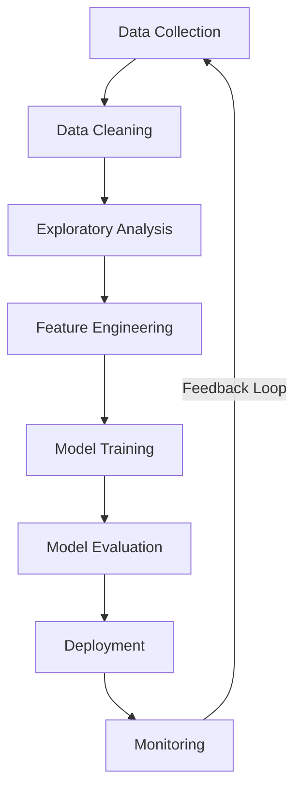
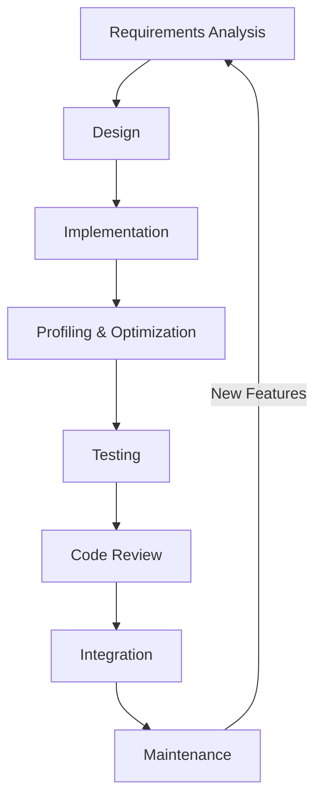

  # Hi, I'm CarvedCoder 👋
  ### Data Scientist & C/C++ Developer | AI Engineer | Problem Solver
  
  Combining algorithmic expertise with data science to build high-performance solutions and extract actionable insights

  
    
  

  
    
  
  
    
  
  
    
  
  
    
  

 
   

## 💫 About Me

- 🔭 I'm currently working on **advanced ML models and high-performance C++ applications**
- 🌱 I'm continually learning **Deep Learning, Distributed Systems, and Modern C++**
- 👯 I'm looking to collaborate on **open-source data science tools and C++ libraries**
- 💬 Ask me about **algorithms, machine learning, or performance optimization**
- 🚀 I love tackling complex computational problems with elegant solutions
- 🌐 Passionate about the intersection of data science and software engineering
- ⚡ Fun fact: **I can debug C++ code while balancing on a skateboard** (not recommended!)

## 🛠️ Tech Stack

  
    
      Data Science & ML
      
        
        
        
        
        
        
        
        
      
    
    
      C/C++ Ecosystem
      
        
        
        
        
        
        
        
        
      
    
    
      Tools & Infrastructure
      
        
        
        
        
        
        
        
        
      
    
  

## 🚀 Featured Projects

  

  

  

  

## 🌊 My Workflows

  
### Data Science Pipeline

### C++ Development Cycle

## 📊 GitHub Analytics

  
    
  
  
    
  

  
    
  

  
  ## 🏆 Achievements
  
  
    
  
  

## 🎓 Education & Certifications

- **M.S. in Computer Science** - Focus on Machine Learning & Algorithms
- **B.S. in Computer Engineering** - Minor in Mathematics
- **Certifications:**
  - Deep Learning Specialization - Coursera/DeepLearning.AI
  - Advanced C++ Programming - Udemy
  - AWS Certified Machine Learning Specialty
  - Professional Data Scientist - DataCamp

## 📫 Let's Connect

  
    
  
  
    
  
  
    
  
  
    
  

  💬 Ask me about machine learning, C++ optimization, data visualization, or algorithmic problem-solving
  🌐 Visit my portfolio: https://2d-game-portfolio-carvedcoders-projects.vercel.app/
  📅 Open for collaboration on data science, C/C++ libraries, and algorithm optimization projects

  

Citations:
[1] https://ppl-ai-file-upload.s3.amazonaws.com/web/direct-files/attachments/62506986/6d7846d0-3397-4d95-8918-6399689d18b1/README.md
[2] https://github.com/academic/awesome-datascience
[3] https://github.com/sfbrigade/data-science-wg/blob/master/dswg_project_resources/Project-README-template.md
[4] https://ubc-library-rc.github.io/rdm/content/03_create_readme.html
[5] https://shields.io/badges
[6] https://github.com/matiassingers/awesome-readme
[7] https://www.cs.odu.edu/~tkennedy/cs417/f23/Public/exampleReadme/index.html
[8] https://cookiecutter-data-science.drivendata.org
[9] https://github.com/mirsazzathossain/mirsazzathossain
[10] https://github.com/sitems/Data-Science-with-CPP-exercise
[11] https://github.com/topics/data-science-projects
[12] https://shields.io
[13] https://cookiecutter-data-science.drivendata.org/v1/
[14] https://github.com/durgeshsamariya/awesome-github-profile-readme-templates/blob/master/templates/DataOnATangent.md
[15] https://github.com/tirthajyoti/Data-science-best-resources/blob/master/README.md
[16] https://github.com/inttter/md-badges
[17] https://medium.datadriveninvestor.com/how-to-write-a-good-readme-for-your-data-science-project-on-github-ebb023d4a50e
[18] https://img.shields.io/badge/Data%20Scientist-Certified-0072B1?style=for-the-badge&logo=data-science&logoColor=white
[19] https://www.reddit.com/r/datascience/comments/oqtknd/github_discussion_what_is_your_favorite_data/
[20] https://github.com/badges/shields
[21] https://hackernoon.com/how-to-create-an-engaging-readme-for-your-data-science-project-on-github
[22] https://github.com/pragyy/datascience-readme-template/blob/main/README.md
[23] https://www.youtube.com/watch?v=4ATucrptdYA
[24] https://github.com/natnew/Awesome-Data-Science
[25] https://gist.github.com/danielecook/94272f387d3366070d2546e2eadefe57
[26] https://data.research.cornell.edu/data-management/sharing/readme/
[27] https://github.com/KalyanM45/Data-Science-Project-Readme-Template
[28] https://github.com/catiaspsilva/README-template
[29] https://www.youtube.com/watch?v=NoTzRfZy1w8
[30] https://github.com/mirsazzathossain/mirsazzathossain
[31] https://www.kdnuggets.com/develop-stand-out-data-science-portfolio-github
[32] https://github.com/equinor/data-science-template/blob/master/README.md
[33] https://github.com/daveebbelaar/data-science-template
[34] https://github.com/abhisheknaiidu/awesome-github-profile-readme
[35] https://github.com/bsamseth/cpp-project/blob/master/README.md
[36] https://img.shields.io/badge/Data%20Scientist-Certified-0072C6?style=flat&logo=data-science&logoColor=white
[37] https://dev.to/github/10-standout-github-profile-readmes-h2o
[38] https://github.com/filipdutescu/modern-cpp-template/blob/master/README.md
[39] https://img.shields.io/badge/-Data%20Science-3498DB?style=flat&logo=anaconda&logoColor=white
[40] https://www.youtube.com/watch?v=7FHiew0_NLQ
[41] https://stackoverflow.com/questions/28316659/readme-file-to-c-project
[42] https://github.com/coderjojo/creative-profile-readme
[43] https://www.makeareadme.com
[44] https://www.reddit.com/r/github/comments/uulygm/what_are_some_really_nice_github_profile_readmes/
[45] https://www.ccbp.in/blog/articles/cpp-projects
[46] https://docs.github.com/en/account-and-profile/setting-up-and-managing-your-github-profile/customizing-your-profile/managing-your-profile-readme
[47] https://cookiecutter-data-science-vc.readthedocs.io/en/latest/getting_started/INSTALL.html
[48] https://rahuldkjain.github.io/gh-profile-readme-generator/
[49] https://www.masaischool.com/blog/how-to-create-an-impressive-github-profile-readme/
[50] https://www.kaggle.com/getting-started/507880
[51] https://www.youtube.com/watch?v=rCt9DatF63I
[52] https://www.youtube.com/watch?v=HrJ3YcUSp7E
[53] https://www.youtube.com/watch?v=G-EGDH50hGE
[54] https://www.dataquest.io/blog/career-guide-data-science-projects-portfolio/
[55] https://hackernoon.com/how-to-create-an-engaging-readme-for-your-data-science-project-on-github
[56] https://github.com/khuyentran1401/Data-science/blob/master/README.md
[57] https://github.com/academic/awesome-datascience/blob/live/README.md
[58] https://github.com/topics/data-science
[59] https://github.com/firmai/data-science-career/blob/master/README.md
[60] https://github.com/nishant-Tiwari24/coding-resources/blob/main/README.md
[61] https://dev.to/envoy_/150-badges-for-github-pnk
[62] https://github.com/drivendataorg/cookiecutter-data-science
[63] https://www.cookiecutter.io/templates
[64] https://drivendata.co/blog/ccds-v2
[65] https://github.com/crmne/cookiecutter-modern-datascience
[66] https://www.sitepoint.com/github-profile-readme/
[67] https://github.com/sajal2692/data-science-portfolio
[68] https://towardsdatascience.com/create-a-simple-continuous-integration-ci-for-medium-rss-feed-in-github-profile-readme-b5dc6fdf6315/
[69] https://github.com/vasukumar92/Data-Science-Portfolio_Vasu-Kumar
[70] https://github.com/aniass/Data-Science-Portfolio
[71] https://www.kaggle.com/code/usmanlovescode/best-portfolio-projects-for-data-science
[72] https://www.projectpro.io/projects/data-science-projects
[73] https://github.com/hosseinmoein/DataFrame

---
Answer from Perplexity: pplx.ai/share
